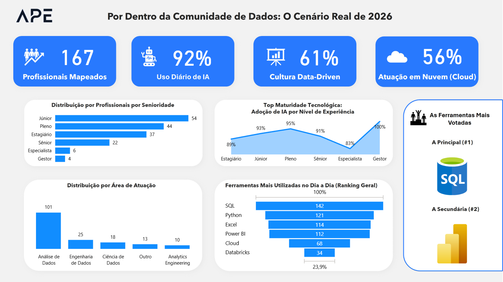

  
# 📊 Raio-X do Mercado de Dados (Live Dashboard)
**Um Produto de Dados End-to-End: Da coleta em tempo real via web à visualização executiva.**

 

## 🔗 Links Oficiais do Projeto

> **Interaja com os dados ou contribua com a comunidade! O pipeline atualiza o painel automaticamente.**

* 📈 **[Acessar o Live Dashboard Interativo (Power BI)](https://app.powerbi.com/view?r=eyJrIjoiYmY4ZGI5OTktYzI0Yi00YjM1LTgzYmItOWYzMmMyMDVkN2RlIiwidCI6ImYzZDgzM2M2LWQ3ZGUtNDFjNC1hYTQ0LTMxZDc2YmYyNzA5YyJ9)**
* 📝 **[Participar da Pesquisa (Formulário Web)](https://pesquisa.apetechnology.com.br/)**

---

## 📌 1. Resumo Executivo e Objetivo
Este projeto nasceu para resolver uma dor real da comunidade de dados: sair da teoria do *"Modern Data Stack"* e mapear o que os profissionais realmente utilizam na trincheira do dia a dia. 

O objetivo foi criar mais do que uma análise estática; desenvolvi um **Produto de Dados vivo**. Uma pesquisa de mercado orgânica foi transformada em um pipeline contínuo, devolvendo insights valiosos sobre adoção de Inteligência Artificial, Nuvem, Cultura Data-Driven e ferramentas essenciais segmentadas por nível de senioridade.

## 🏗️ 2. Arquitetura e Stack Tecnológica
O projeto foi construído cobrindo todo o ciclo de vida do dado (End-to-End):

* **Coleta de Dados / Front-end:** Formulário web próprio, otimizado para UX e hospedado em domínio da APE Technology.
* **Banco de Dados / Cloud:** Supabase (PostgreSQL) atuando como repositório em nuvem para armazenamento em tempo real.
* **ETL e Engenharia de Dados:** Power Query (limpeza, normalização e modelagem dimensional).
* **Modelagem e Análise:** Power BI (Linguagem DAX).
* **UI/UX Design:** Backgrounds premium e wireframing desenvolvidos no PowerPoint seguindo o branding corporativo.

## 🚀 3. Execução e Desafios Técnicos Resolvidos

### 🔹 Estratégia de Coleta e UX (Visão de Negócio)
Aplicação do **Princípio de Pareto (80/20)** na elaboração do questionário. Ferramentas-chave (Excel, SQL, Python, Databricks, etc.) foram priorizadas para evitar formulários longos, reduzindo o tempo de resposta para menos de 30 segundos e mitigando a taxa de abandono.

### 🔹 Engenharia de Dados e Pipeline Vivo
Para garantir que o dashboard não dependesse de arquivos estáticos (CSV/Excel), estabeleci uma **conexão direta do Power BI com o banco PostgreSQL (Supabase)**. 
* **O Desafio:** A coluna de "ferramentas do dia a dia" capturava múltiplos valores na mesma string (Ex: *"SQL, Python, Excel"*).
* **A Solução:** Criei uma tabela auxiliar (Fato) no Power Query utilizando a técnica de **Unpivot** (Transformar Colunas em Linhas) e divisão por delimitador. Estruturei um relacionamento `1:N` no modelo relacional, permitindo a contagem precisa de ferramentas sem duplicar a volumetria de respondentes.

### 🔹 Data Visualization e Tratamento Analítico
* **Pódio Dinâmico:** Uso inovador de renderização de URLs de imagens nativas no Power BI para criar um Top 1 e Top 2 dinâmico com as logos das ferramentas mais votadas.
* **Resolução de Bugs de DAX:** Tratamento do "Problema de Empate" (*Tie-breaker*) nos filtros de Top N utilizando a lógica `FIRST` em DAX.
* **Ordenação Hierárquica:** Criação de colunas de indexação para garantir a ordenação correta do Eixo X nas progressões de carreira (*Estagiário -> Júnior -> Pleno -> Sênior -> Gestor*).

### 🔹 Marketing Orgânico
Estratégia de distribuição *one-to-one* focada na comunidade (via LinkedIn DM), resultando em mais de 140 respostas orgânicas (Fase 1) em menos de 48 horas de deploy.

## 💡 4. Principais Insights Extraídos
O dashboard interativo permite filtrar a realidade de múltiplas subáreas (Engenharia, Ciência e Análise). Até o momento, a base provou que:
1. **O domínio da IA:** A Inteligência Artificial já é uma realidade operacional diária, com altíssima taxa de adoção em todas as frentes.
2. **A base inabalável:** O SQL permanece como o líder absoluto e requisito fundamental na fundação da stack de dados.
3. **Maturidade Tecnológica:** Existe uma correlação visual clara entre a progressão de senioridade e o aumento proporcional do uso de soluções em Nuvem.

---
**Autor:** Guilherme R. Almeida Rosa | Fundador da APE  
*Fase 2 do projeto (Implementação de Machine Learning para clusterização de perfis) em planejamento.*
